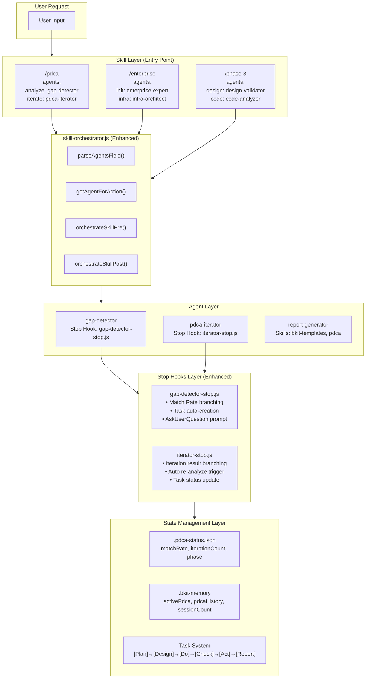
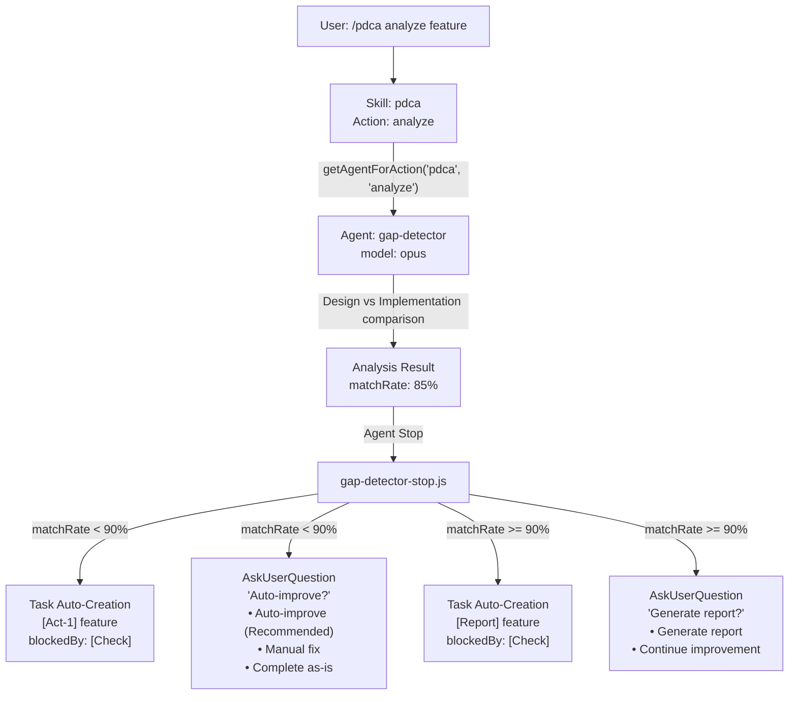

# Context Engineering Principles

> Optimal token curation for LLM inference - bkit's core design principle
>
> **v1.4.1**: Analyzing bkit architecture from Context Engineering perspective
>
> **v1.4.2**: Complete Context Engineering implementation with 8 functional requirements (FR-01~FR-08)
>
> **v1.4.4**: Skills-Agents multi-binding architecture, PDCA Skill integration (8 actions)
>
> **v1.4.5**: `/pdca archive` action, 8-language trigger completion, internationalization (KO→EN)
>
> **v1.5.0**: Claude Code Exclusive - simplified architecture
>
> **v1.5.3**: Agent Teams with team/ module (9 files, 40 exports), state-writer, SubagentStart/Stop hooks
>
> **v1.5.4**: lib/ modularization (5 subdirs, 180 exports), 10 hook events, bkend MCP accuracy fix
>
> **v1.5.3-gemini**: Tool Registry centralization, 17 built-in tool names verified from Gemini CLI source, "Tool Name Accuracy" as Context Engineering principle
>
> **v1.5.6**: CC v2.1.59 auto-memory integration, ENH-48~51, 182 exports
>
> **v1.5.6-gemini**: Gemini CLI v0.31.0 migration - RuntimeHook preparation, Tool Annotations, Project-level Policy, 18 feature flags
>
> **v1.5.7**: CC_COMMAND_PATTERNS (8-lang CC command awareness), /simplify + /batch PDCA integration, 182 exports, English conversion (3 stop scripts)
>
> **v1.5.8**: Path Registry (lib/core/paths.js), state directory migration (.bkit/{state,runtime,snapshots}/), 186 exports, auto-migration with EXDEV fallback
> **v1.5.9**: Executive Summary, AskUserQuestion Preview UX, ENH-74~81, 199 exports

## What is Context Engineering?

Context Engineering is **the practice of optimally curating context tokens for LLM inference**.

```
Traditional Prompt Engineering:
  "The art of writing good prompts"

Context Engineering:
  "The art of designing systems that integrate prompts, tools, and state
   to provide LLMs with optimal context for inference"
```

bkit is a **practical implementation of Context Engineering**, providing a systematic context management system for Claude Code.

---

## v1.5.4 Context Engineering Architecture

bkit v1.5.4 builds on the original 8 functional requirements (FR-01~FR-08) with modular library architecture, Agent Teams orchestration, and expanded hook events:

```
┌──────────────────────────────────────────────────────────────────────────────┐
│                    bkit v1.5.4 Context Engineering Architecture              │
├──────────────────────────────────────────────────────────────────────────────┤
│                                                                              │
│  ┌────────────────────────────────────────────────────────────────────────┐  │
│  │                 Multi-Level Context Hierarchy (FR-01)                  │  │
│  │                                                                        │  │
│  │  L1: Plugin Policy ──→ L2: User Config ──→ L3: Project ──→ L4: Session │  │
│  │     (bkit defaults)     (~/.claude/bkit/)   (.pdca-status)   (runtime) │  │
│  │                                                                        │  │
│  │  Priority: L4 > L3 > L2 > L1 (later levels override earlier)           │  │
│  └────────────────────────────────────────────────────────────────────────┘  │
│                                     │                                        │
│                                     ▼                                        │
│  ┌───────────────────┐  ┌──────────────────┐  ┌──────────────────┐           │
│  │ @import Directive │  │ context:fork     │  │ Permission       │           │
│  │ (FR-02)           │  │ (FR-03)          │  │ Hierarchy (FR-05)│           │
│  │                   │  │                  │  │                  │           │
│  │ • SKILL.md loads  │  │ • Isolated exec  │  │ • deny: block    │           │
│  │ • Variable subst  │  │ • Deep clone     │  │ • ask: confirm   │           │
│  │ • Circular detect │  │ • Merge-back opt │  │ • allow: permit  │           │
│  └────────┬──────────┘  └────────┬─────────┘  └─────────┬────────┘           │
│           │                      │                      │                    │
│           └──────────────────────┼──────────────────────┘                    │
│                                  ▼                                           │
│  ┌─────────────────────────────────────────────────────────────────────────┐ │
│  │                  6-Layer Hook System (10 Events)                        │ │
│  │                                                                         │ │
│  │  L1: hooks.json ─→ SessionStart, UserPromptSubmit, PreCompact           │ │
│  │                     TaskCompleted, SubagentStart/Stop, TeammateIdle     │ │
│  │  L2: Skill YAML ─→ PreToolUse, PostToolUse, Stop                        │ │
│  │  L3: Agent YAML ─→ PreToolUse, PostToolUse                              │ │
│  │  L4: Triggers   ─→ 8-language keyword detection                         │ │
│  │  L5: Scripts    ─→ 47 Node.js modules                                   │ │
│  │  L6: Team Orch. ─→ CTO-led phase routing (leader/council/swarm/watch)   │ │
│  └─────────────────────────────────────────────────────────────────────────┘ │
│                                  │                                           │
│           ┌──────────────────────┼──────────────────────┐                    │
│           ▼                      ▼                      ▼                    │
│  ┌───────────────────┐  ┌──────────────────┐  ┌──────────────────┐           │
│  │ Task Dependency   │  │ Context Compact. │  │ MEMORY Variable  │           │
│  │ Chain (FR-06)     │  │ Hook (FR-07)     │  │ (FR-08)          │           │
│  │                   │  │                  │  │                  │           │
│  │ • PDCA blocking   │  │ • State snapshot │  │ • Session persist│           │
│  │ • blockedBy meta  │  │ • Auto-cleanup   │  │ • Key-value store│           │
│  │ • Non-blocking    │  │ • 10 recent kept │  │ • .bkit-memory   │           │
│  └───────────────────┘  └──────────────────┘  └──────────────────┘           │
│                                  │                                           │
│                                  ▼                                           │
│  ┌─────────────────────────────────────────────────────────────────────────┐ │
│  │              Agent Teams Orchestration (v1.5.3+)                        │ │
│  │                                                                         │ │
│  │  CTO Lead (opus) ──→ Orchestration Pattern per Phase                    │ │
│  │       │                                                                 │ │
│  │       ├── Teammate A (own context window)                               │ │
│  │       ├── Teammate B (own context window)                               │ │
│  │       └── Teammate C (own context window)                               │ │
│  │                                                                         │ │
│  │  State: .bkit/agent-state.json (schema v1.0)                            │ │
│  │  Modules: lib/team/ (9 files, 40 exports)                               │ │
│  └─────────────────────────────────────────────────────────────────────────┘ │
│                                                                              │
└──────────────────────────────────────────────────────────────────────────────┘
```

### Library Modules (15 modules across 5 subdirectories, 199 exports)

**Modular subdirectories** (v1.5.4 — refactored from monolithic common.js):

| Module | Files | Exports | Purpose |
|--------|:-----:|:-------:|---------|
| `lib/core/` | 7 | 41 | Platform detection, cache, I/O, debug, config, file utilities |
| `lib/pdca/` | 6 | 54 | Tier classification, level detection, phase management, status, automation |
| `lib/intent/` | 4 | 19 | 8-language detection, trigger matching, ambiguity analysis |
| `lib/task/` | 5 | 26 | Task classification, context, creation, tracking |
| `lib/team/` | 9 | 40 | Coordinator, strategy, CTO logic, state-writer, communication |
| **Subtotal** | **31** | **199** | |

**Top-level modules** (FR implementations, unchanged):

| Module | FR | Purpose | Key Functions |
|--------|:--:|---------|---------------|
| `lib/context-hierarchy.js` | FR-01 | Multi-level context management | `getContextHierarchy()`, `mergeContextLevels()`, `setSessionContext()` |
| `lib/import-resolver.js` | FR-02 | @import directive processing | `resolveImports()`, `resolveVariables()`, `detectCircularImport()` |
| `lib/context-fork.js` | FR-03 | Context isolation | `forkContext()`, `mergeForkedContext()`, `discardFork()` |
| `lib/permission-manager.js` | FR-05 | Permission hierarchy | `checkPermission()`, `getToolPermission()` |
| `lib/memory-store.js` | FR-08 | Session persistence | `setMemory()`, `getMemory()`, `deleteMemory()` |
| `lib/skill-orchestrator.js` | — | Skill routing | `orchestrateSkillPre()`, `getAgentForAction()` |
| `lib/common.js` | All | **Bridge layer** | Re-exports all 199 functions for backward compatibility |

---

## bkit's Context Engineering Structure

### 1. Domain Knowledge Layer (27 Skills)

Skills provide **structured domain knowledge**.

```
┌─────────────────────────────────────────────────────────────────┐
│                    Domain Knowledge Layer                        │
├─────────────────────────────────────────────────────────────────┤
│                                                                 │
│  ┌─────────────┐  ┌─────────────┐  ┌─────────────┐             │
│  │ Core (2)    │  │ Level (3)   │  │ Pipeline(10)│             │
│  │             │  │             │  │             │             │
│  │ bkit-rules  │  │ starter     │  │ phase-1~9   │             │
│  │ bkit-templ  │  │ dynamic     │  │ development │             │
│  │             │  │ enterprise  │  │ -pipeline   │             │
│  └─────────────┘  └─────────────┘  └─────────────┘             │
│                                                                 │
│  ┌─────────────────────────────────────────────────────────┐   │
│  │                  Specialized (3)                         │   │
│  │  zero-script-qa │ mobile-app │ desktop-app              │   │
│  └─────────────────────────────────────────────────────────┘   │
│                                                                 │
└─────────────────────────────────────────────────────────────────┘
```

**Context Engineering Techniques**:

| Technique | Application | Effect |
|-----------|-------------|--------|
| **Hierarchical Tables** | Level/Phase-specific methods | Conditional knowledge selection |
| **ASCII Diagrams** | Architecture visualization | Structural understanding |
| **Checklists** | Clear completion criteria | Enables automation |
| **Code Examples** | Ready-to-apply references | Consistent implementation |

### 2. Behavioral Rules Layer (16 Agents)

Agents define **role-based behavioral rules**.

```
┌─────────────────────────────────────────────────────────────────┐
│                    Behavioral Rules Layer                        │
├─────────────────────────────────────────────────────────────────┤
│                                                                 │
│  ┌─────────────────────────────────────────────────────────┐   │
│  │              Role Definition Pattern                     │   │
│  │                                                         │   │
│  │  1. Specify expertise (Expert in X)                     │   │
│  │  2. Define responsibility scope (responsible for X)     │   │
│  │  3. Specify level (CTO-level, beginner-friendly)        │   │
│  │  4. Reference real cases (bkamp.ai case study)          │   │
│  └─────────────────────────────────────────────────────────┘   │
│                                                                 │
│  ┌─────────────────────────────────────────────────────────┐   │
│  │              Constraint Specification                    │   │
│  │                                                         │   │
│  │  • Permission Mode: plan | acceptEdits                  │   │
│  │  • Allowed/Disallowed Tools                             │   │
│  │  • Score Thresholds (70/90%)                            │   │
│  │  • Workflow Rules (docs first, step-by-step)            │   │
│  └─────────────────────────────────────────────────────────┘   │
│                                                                 │
└─────────────────────────────────────────────────────────────────┘
```

**Model Selection Strategy by Agent**:

| Model | Agents | Characteristics |
|-------|--------|-----------------|
| **opus** | cto-lead, code-analyzer, design-validator, gap-detector, enterprise-expert, infra-architect, security-architect | Strategic leadership, complex analysis |
| **sonnet** | bkend-expert, pdca-iterator, pipeline-guide, starter-guide, product-manager, frontend-architect, qa-strategist | Execution, guidance, iteration |
| **haiku** | qa-monitor, report-generator | Fast monitoring, document generation |

### 3. State Management Layer (5-Module Architecture)

A **modular state management system** composed of 199 exports across 5 subdirectories, with `lib/common.js` as a backward-compatible bridge layer.

```
┌─────────────────────────────────────────────────────────────────────┐
│                   State Management Layer (v1.5.4)                    │
├─────────────────────────────────────────────────────────────────────┤
│                                                                      │
│  ┌──────────────────┐  ┌──────────────────┐  ┌──────────────────┐  │
│  │  lib/core/       │  │  lib/pdca/       │  │  lib/intent/     │  │
│  │  7 files, 41 exp │  │  6 files, 54 exp │  │  4 files, 19 exp │  │
│  │                  │  │                  │  │                  │  │
│  │  • Platform      │  │  • Tier          │  │  • Language (8)  │  │
│  │  • Cache (TTL)   │  │  • Level         │  │  • Trigger match │  │
│  │  • I/O           │  │  • Phase         │  │  • Ambiguity     │  │
│  │  • Debug         │  │  • Status        │  │                  │  │
│  │  • Config        │  │  • Automation    │  │                  │  │
│  │  • File          │  │  • readBkitMem   │  │                  │  │
│  └──────────────────┘  └──────────────────┘  └──────────────────┘  │
│                                                                      │
│  ┌──────────────────┐  ┌──────────────────┐  ┌──────────────────┐  │
│  │  lib/task/       │  │  lib/team/       │  │  lib/common.js   │  │
│  │  5 files, 26 exp │  │  9 files, 40 exp │  │  (Bridge Layer)  │  │
│  │                  │  │                  │  │                  │  │
│  │  • Classification│  │  • Coordinator   │  │  Re-exports all  │  │
│  │  • Context       │  │  • Strategy      │  │  199 functions   │  │
│  │  • Creator       │  │  • CTO Logic     │  │  from 5 modules  │  │
│  │  • Tracker       │  │  • State-Writer  │  │  for backward    │  │
│  │                  │  │  • Communication │  │  compatibility   │  │
│  │                  │  │  • Task Queue    │  │                  │  │
│  │                  │  │  • Orchestrator  │  │                  │  │
│  └──────────────────┘  └──────────────────┘  └──────────────────┘  │
│                                                                      │
└─────────────────────────────────────────────────────────────────────┘
```

> **Migration Note**: As of v1.5.4, `lib/common.js` is a pure bridge layer. All 199 functions originate in subdirectory modules. Existing scripts that `require('./lib/common.js')` continue to work without changes.

---

## 6-Layer Hook System (10 Events)

bkit's context injection occurs at **6 layers** with **10 hook events**.

```
Layer 1: hooks.json (Global)
         └── SessionStart, UserPromptSubmit, PreCompact
         └── TaskCompleted, SubagentStart, SubagentStop, TeammateIdle

Layer 2: Skill Frontmatter
         └── hooks: { PreToolUse, PostToolUse, Stop }

Layer 3: Agent Frontmatter
         └── hooks: { PreToolUse, PostToolUse }

Layer 4: Description Triggers
         └── "Triggers:" keyword matching (8 languages)

Layer 5: Scripts (47 modules)
         └── Actual Node.js logic execution

Layer 6: Team Orchestration (v1.5.3+)
         └── CTO-led phase routing, orchestration pattern selection
         └── Patterns: leader | council | swarm | watchdog
```

**Context Injection by Hook Event** (10 events):

| Event | Timing | Injection Type |
|-------|--------|----------------|
| **SessionStart** | Session start | Onboarding, PDCA status, trigger table |
| **UserPromptSubmit** | Before AI processing | Intent detection, agent/skill triggers, ambiguity |
| **PreToolUse** | Before tool execution | Validation checklist, convention hints |
| **PostToolUse** | After tool execution | Next step guide, analysis suggestion |
| **Stop** | Agent termination | State transition, user choice prompt |
| **PreCompact** | Before compaction | PDCA state snapshot preservation |
| **TaskCompleted** | Task completion | Auto-advance to next PDCA phase |
| **SubagentStart** | Subagent startup | Agent state recording, team registration |
| **SubagentStop** | Subagent shutdown | Agent state cleanup, result collection |
| **TeammateIdle** | Teammate idle | Task reassignment, idle state handling |

---

## Dynamic Context Injection Patterns

### Pattern 1: Task Size → PDCA Level

```javascript
// lib/task/classification.js (re-exported via lib/common.js)
const classification = {
  quick_fix: lines < 10,      // PDCA: None
  minor_change: lines < 50,   // PDCA: Light mention
  feature: lines < 200,       // PDCA: Recommended
  major_feature: lines >= 200 // PDCA: Required
};
```

### Pattern 2: User Intent → Agent/Skill Auto-Trigger

```javascript
// lib/intent/trigger.js (re-exported via lib/common.js)
const implicitPatterns = {
  'gap-detector': {
    patterns: [/맞아\??/, /이거 괜찮아\??/, /is this right\?/i],
    contextRequired: ['design', 'implementation']
  },
  'pdca-iterator': {
    patterns: [/고쳐/, /개선해줘/, /make.*better/i],
    contextRequired: ['check', 'act']
  }
};
```

### Pattern 3: Ambiguity Score → Clarifying Questions

```javascript
// lib/intent/ambiguity.js (re-exported via lib/common.js)
// Score >= 50 → Trigger AskUserQuestion

// Addition factors
- No specific nouns: +20
- Undefined scope: +20
- Multiple interpretations possible: +30
- Context conflict: +30

// Subtraction factors
- Contains file path: -30
- Contains technical terms: -20

// Magic Word Bypass
!hotfix, !prototype, !bypass → Score = 0
```

### Pattern 4: Match Rate → Check-Act Iteration

```
gap-detector (Check) → Calculate Match Rate
    ├── >= 90% → report-generator (Complete)
    ├── 70-89% → AskUserQuestion (manual/auto choice)
    └── < 70%  → Strongly recommend pdca-iterator
                      ↓
                 Re-run gap-detector
                      ↓
                 Repeat (max 5 iterations)
```

---

## Response Report Rule (v1.4.1)

Reports bkit feature usage status at the end of every response.

```markdown
─────────────────────────────────────────────────
📊 bkit Feature Usage Report
─────────────────────────────────────────────────
✅ Used: [bkit features used in this response]
⏭️ Not Used: [Major unused features] (reason)
💡 Recommended: [Features suitable for next task]
─────────────────────────────────────────────────
```

**Recommendations by PDCA Stage**:

| Current Status | Recommendation |
|----------------|----------------|
| No PDCA | Start with `/pdca plan` |
| Plan complete | Design with `/pdca design` |
| Design complete | Implement or `/pdca next` |
| Do complete | Gap analysis with `/pdca analyze` |
| Check < 90% | Auto-improve with `/pdca iterate` |
| Check >= 90% | Complete with `/pdca report` |

---

## Component Architecture (v1.5.4)

> **Note**: As of v1.5.0, bkit is Claude Code exclusive. v1.5.3 adds Team Visibility + SubagentStart/Stop hooks.
> **v1.5.4**: MCP tool accuracy is a critical Context Engineering concern -- providing exact tool names (not numbered lists) ensures LLMs invoke the correct MCP tools without hallucinating tool names. bkend MCP tools expanded 19→28+ with accurate naming across 4 categories.

| Component | Location | Count |
|-----------|----------|:-----:|
| Skills | `skills/*/SKILL.md` | 26 |
| Agents | `agents/*.md` | 16 |
| Scripts | `scripts/*.js` | 47 |
| Templates | `templates/*.md` + `pipeline/` + `shared/` | 13 + subdirs |
| lib/ modules | `lib/core/`, `lib/pdca/`, `lib/intent/`, `lib/task/`, `lib/team/` | 5 dirs, 199 exports |
| lib/ top-level | `context-hierarchy`, `import-resolver`, `context-fork`, `permission-manager`, `memory-store`, `skill-orchestrator`, `common` (bridge) | 7 modules |
| Output Styles | `output-styles/*.md` | 4 |
| Context File | `CLAUDE.md` | 1 |
| Manifest | `.claude-plugin/plugin.json` | 1 |

---

## Functional Requirements (FR-01~FR-08, stable since v1.4.2)

### FR-01: Multi-Level Context Hierarchy

A 4-level context hierarchy with priority-based merging.

```
L1: Plugin Policy (${PLUGIN_ROOT}/bkit.config.json)
    ↓ override
L2: User Config (~/.claude/bkit/user-config.json)
    ↓ override
L3: Project Config (${PROJECT_DIR}/bkit.config.json)
    ↓ override
L4: Session Context (in-memory runtime state)
```

**Implementation**: `lib/context-hierarchy.js` (282 lines)

**Key Functions**:
- `getContextHierarchy()`: Load and merge all 4 levels
- `getHierarchicalConfig(keyPath)`: Access config by dot-notation path
- `setSessionContext(key, value)`: Set runtime session values
- `getUserConfigDir()`: Platform-specific user config directory

**Usage**:
```javascript
const { getHierarchicalConfig } = require('./lib/context-hierarchy.js');

// Get merged value from hierarchy (L4 > L3 > L2 > L1)
const threshold = getHierarchicalConfig('pdca.matchThreshold'); // e.g., 90
```

### FR-02: @import Directive

External context file loading with variable substitution.

**Supported Variables**:
- `${PLUGIN_ROOT}` - bkit plugin installation directory
- `${PROJECT}` - Current project directory
- `${USER_CONFIG}` - User config directory

**Syntax in SKILL.md/Agent.md frontmatter**:
```yaml
---
name: my-skill
imports:
  - ./shared/api-patterns.md
  - ${PLUGIN_ROOT}/templates/error-handling.md
  - ${PROJECT}/conventions.md
---
```

**Implementation**: `lib/import-resolver.js` (272 lines)

**Features**:
- Relative and absolute path resolution
- Variable substitution
- Circular dependency detection
- TTL-based caching

**Shared Context Files** (`templates/shared/`):
| File | Purpose |
|------|---------|
| `api-patterns.md` | RESTful API design patterns |
| `error-handling-patterns.md` | Error handling best practices |
| `naming-conventions.md` | Naming convention standards |

### FR-03: Context Fork Isolation

Skills/Agents can execute in isolated context copies.

**Frontmatter Extension**:
```yaml
---
name: gap-detector
context: fork      # fork | shared (default)
mergeResult: false # merge result back to parent
---
```

**Implementation**: `lib/context-fork.js` (228 lines)

**Key Functions**:
- `forkContext(skillName, options)`: Create isolated deep clone
- `mergeForkedContext(forkId)`: Merge results back (arrays dedupe, objects merge)
- `discardFork(forkId)`: Discard without merging
- `getActiveForks()`: List active fork contexts

**Usage**:
```javascript
const { forkContext, mergeForkedContext, discardFork } = require('./lib/context-fork.js');

const { forkId, context } = forkContext('my-skill', { mergeResult: true });
// ... isolated operations on context ...
mergeForkedContext(forkId);  // or discardFork(forkId)
```

**Agents Using Fork**:
- `gap-detector.md` - context: fork, mergeResult: false
- `design-validator.md` - context: fork, mergeResult: false

### FR-04: UserPromptSubmit Hook

User input preprocessing before AI processing.

**Hook Registration** (`hooks/hooks.json`):
```json
{
  "UserPromptSubmit": [{
    "hooks": [{
      "type": "command",
      "command": "node ${CLAUDE_PLUGIN_ROOT}/scripts/user-prompt-handler.js",
      "timeout": 3000
    }]
  }]
}
```

**Implementation**: `scripts/user-prompt-handler.js` (110 lines)

**Processing Flow**:
1. Feature Intent Detection - Detect new feature requests
2. Agent Trigger Detection - Match implicit agent triggers (8 languages)
3. Skill Trigger Detection - Match implicit skill triggers
4. Ambiguity Detection - Calculate ambiguity score

**Output**:
```json
{
  "hookSpecificOutput": {
    "hookEventName": "UserPromptSubmit",
    "additionalContext": "Detected intent: new feature 'auth-system'"
  }
}
```

### FR-05: Permission Hierarchy

Three-level permission system for tool access control.

**Permission Levels**:
| Level | Value | Behavior |
|-------|:-----:|----------|
| `deny` | 0 | Block tool execution (exit code 2) |
| `ask` | 1 | Add confirmation context |
| `allow` | 2 | Permit execution (default) |

**Configuration** (`bkit.config.json`):
```json
{
  "permissions": {
    "Write": "allow",
    "Bash(rm -rf*)": "deny",
    "Bash(git push --force*)": "deny",
    "Bash(docker system prune*)": "ask"
  }
}
```

**Implementation**: `lib/permission-manager.js` (205 lines)

**Key Functions**:
- `checkPermission(toolName, toolInput)`: Check permission level
- `getToolPermission(toolName)`: Get configured permission
- Pattern matching with glob-style wildcards

### FR-06: Task Dependency Chain

PDCA phase-based task blocking using Claude Code Task System.

**Task Classification Behavior**:
| Classification | Lines | Task Created | blockedBy |
|---------------|:-----:|:------------:|:---------:|
| quick_fix | <10 | ❌ Skip | N/A |
| minor_change | <50 | ❌ Skip | N/A |
| feature | <200 | ✅ Yes | Optional |
| major_feature | ≥200 | ✅ Yes | Auto-set |

**Non-Blocking PDCA**: `blockedBy` is dependency tracking metadata, not a hard block.

**Implementation**: `lib/task/creator.js` - `autoCreatePdcaTask()` (re-exported via `lib/common.js`)

### FR-07: Context Compaction Hook

Preserve PDCA state during context compaction.

**Hook Registration** (`hooks/hooks.json`):
```json
{
  "PreCompact": [{
    "matcher": "auto|manual",
    "hooks": [{
      "type": "command",
      "command": "node ${CLAUDE_PLUGIN_ROOT}/scripts/context-compaction.js",
      "timeout": 5000
    }]
  }]
}
```

**Implementation**: `scripts/context-compaction.js` (96 lines)

**Features**:
- PDCA state snapshot to `docs/.pdca-snapshots/`
- Automatic cleanup (keeps 10 most recent)
- State summary in output for context restoration

### FR-08: MEMORY Variable Support

Session-persistent key-value storage.

**Storage Location**: `docs/.bkit-memory.json`

**Implementation**: `lib/memory-store.js` (189 lines)

**API**:
```javascript
const { setMemory, getMemory, deleteMemory, getAllMemory, clearMemory } = require('./lib/memory-store.js');

setMemory('lastFeature', 'auth-system');
const feature = getMemory('lastFeature', 'default');
deleteMemory('lastFeature');
const all = getAllMemory();
clearMemory();
```

**Use Cases**:
- Session counter tracking
- Last active feature persistence
- User preference storage
- Cross-session state

---

## Module Integration Map

All modules are integrated through the following call paths:

**Top-level FR modules**:

| Module | Called From | Trigger |
|--------|-------------|---------|
| `context-hierarchy.js` | `hooks/session-start.js` | SessionStart |
| `import-resolver.js` | `hooks/session-start.js`, `user-prompt-handler.js` | SessionStart, UserPromptSubmit |
| `context-fork.js` | `hooks/session-start.js` | SessionStart (stale fork cleanup) |
| `permission-manager.js` | `scripts/pre-write.js` | PreToolUse (Write\|Edit) |
| `memory-store.js` | `hooks/session-start.js` | SessionStart |
| `skill-orchestrator.js` | `scripts/skill-post.js` | Skill invocation |

**Subdirectory modules** (via `lib/common.js` bridge):

| Module | Called From | Trigger |
|--------|-------------|---------|
| `lib/core/*` | All scripts | Platform, cache, I/O, debug, config, file operations |
| `lib/pdca/*` | PDCA scripts, stop hooks | Phase transitions, status updates, tier detection |
| `lib/intent/*` | `user-prompt-handler.js` | UserPromptSubmit (language/trigger/ambiguity) |
| `lib/task/*` | Stop hooks, PDCA scripts | Task creation, classification, tracking |
| `lib/team/*` | Team hooks, CTO logic | SubagentStart/Stop, TeammateIdle, orchestration |

---

## v1.4.4 Architecture Diagrams

### Component Diagram (6-Layer Architecture)



### Data Flow (PDCA Analyze Cycle)



### Component Dependencies

| Component | Depends On | Purpose |
|-----------|-----------|---------|
| `skill-orchestrator.js` | `lib/common.js` | PDCA state management functions |
| `gap-detector-stop.js` | `lib/common.js` | Task creation, state update |
| `iterator-stop.js` | `lib/common.js` | Task update, phase transition |
| `pdca` skill | `templates/*.md` | Template imports |
| `agents/*.md` | `skills` | `skills_preload`, `skills` fields |

### Agents Multi-Binding

v1.4.4 introduces `agents` field for action-specific agent routing:

```yaml
# Single binding (backward compatible)
agent: starter-guide

# Multi-binding (v1.4.4)
agents:
  analyze: gap-detector      # /pdca analyze → gap-detector
  iterate: pdca-iterator     # /pdca iterate → pdca-iterator
  report: report-generator   # /pdca report → report-generator
  default: gap-detector      # fallback agent
```

**Skills with Multi-Binding**:
| Skill | Actions | Agents |
|-------|---------|--------|
| `pdca` | analyze, iterate, report | gap-detector, pdca-iterator, report-generator |
| `enterprise` | init, strategy, infra | enterprise-expert, infra-architect |
| `phase-8-review` | design, code | design-validator, code-analyzer |

---

## v1.5.x Context Engineering Features

### Output Styles as Context Layer (v1.5.1)

Output Styles add a response formatting context layer:

| Style | Context Injection |
|-------|-------------------|
| `bkit-learning` | Learning points, TODO(learner) markers, concept explanations |
| `bkit-pdca-guide` | Status badges, checklists, gap analysis suggestions |
| `bkit-enterprise` | Tradeoff tables, cost impact, deployment strategy |
| `bkit-pdca-enterprise` | Enterprise PDCA report styling |

**Auto-Selection**: Level detection → Output style suggestion (Starter→learning, Dynamic→pdca-guide, Enterprise→enterprise)

**Configuration** (`bkit.config.json`):
```json
{
  "outputStyles": {
    "directory": "output-styles",
    "available": ["bkit-pdca-guide", "bkit-learning", "bkit-enterprise", "bkit-pdca-enterprise"],
    "levelDefaults": {
      "Starter": "bkit-learning",
      "Dynamic": "bkit-pdca-guide",
      "Enterprise": "bkit-enterprise"
    }
  }
}
```

> **Note**: Plugin must declare `"outputStyles": "./output-styles/"` in `plugin.json` for discovery.

### CTO-Led Agent Teams as Parallel Context (v1.5.1+)

CTO-Led Agent Teams enable orchestrated parallel context management:
- CTO Lead (opus) coordinates all context flow across teammates
- Each teammate operates with its own context window per PDCA phase
- Phase-specific agents focus on their domain context
- Orchestrator selects pattern (Leader/Council/Swarm/Watchdog) per phase
- Communication module manages structured team messages (7 types)

**Orchestration Patterns by Level**:

| Level | Plan | Design | Do | Check | Act |
|-------|------|--------|-----|-------|-----|
| Dynamic | leader | leader | swarm | council | leader |
| Enterprise | leader | council | swarm | council | watchdog |

**Team Configuration** (`bkit.config.json`):
```json
{
  "team": {
    "enabled": true,
    "displayMode": "in-process",
    "maxTeammates": 5,
    "ctoAgent": "cto-lead",
    "levelOverrides": {
      "Dynamic": { "maxTeammates": 3 },
      "Enterprise": { "maxTeammates": 5 }
    }
  }
}
```

### Team Visibility & State Writer (v1.5.3)

The `lib/team/state-writer.js` module (9 exports) persists agent team state for external tools (e.g., bkit Studio IPC):

- **State file**: `.bkit/agent-state.json` (schema v1.0)
- **Tracked data**: Agent status, phase progress, teammate assignments
- **New hooks**: `SubagentStart`, `SubagentStop` for lifecycle tracking
- **Handlers**: `subagent-start-handler.js`, `subagent-stop-handler.js`, `team-idle-handler.js`

### Agent Memory as Persistent Context (v1.5.1)

Agent Memory implements cross-session context persistence:

| Scope | Location | Persistence |
|-------|----------|-------------|
| `project` | `.claude/agent-memory/` | Per-project, across sessions |
| `user` | `~/.claude/agent-memory/` | Global, across all projects |
| `local` | `.claude/agent-memory-local/` | Per-project, local only |

9 agents use `project` scope, 2 agents (starter-guide, pipeline-guide) use `user` scope.

### MCP Tool Accuracy (v1.5.4)

MCP tool accuracy is a critical Context Engineering concern. Providing exact tool names (not numbered lists) ensures LLMs invoke the correct MCP tools without hallucinating names.

- bkend MCP tools expanded: 19 → 28+ tools
- Accurate naming across 4 categories (auth, data, storage, management)
- Each tool documented with exact name, parameters, and examples

### Gemini CLI v0.31.0 Migration (v1.5.6-gemini)

v1.5.6 extends bkit-gemini with Gemini CLI v0.31.0 stable support, adding 3 major context engineering capabilities:

**1. RuntimeHook Function Preparation** (`lib/adapters/gemini/hook-adapter.js`):
- SDK-based `HookSystem.registerHook()` abstraction layer
- `HOOK_EVENT_MAP`: 10 entries mapping PascalCase (hooks.json) to snake_case (SDK) event names
- `supportsRuntimeHookFunctions()`, `getRuntimeHookTemplate()` for version-gated detection
- Actual SDK transition deferred to v1.6.0 pending stable `@anthropic-ai/gemini-cli-sdk`

**2. Tool Annotation Metadata** (`lib/adapters/gemini/tool-registry.js`):
- `TOOL_ANNOTATIONS`: All 17 built-in tools with `readOnlyHint`, `destructiveHint`, `idempotentHint`
- `getToolAnnotations(toolName)`: Query annotations for trust-model-aware tool selection
- `isReadOnlyTool(toolName)`, `getStrictReadOnlyTools()`: Annotation-based read-only classification
- `getReadOnlyTools()` kept hardcoded for backward compatibility

**3. Project-level Policy (Tier 3)** (`lib/adapters/gemini/policy-migrator.js`):
- `LEVEL_POLICY_TEMPLATES`: Starter (10 rules, restrictive), Dynamic (7 rules, balanced), Enterprise (5 rules, permissive)
- All templates use `tier: 3` (workspace level) which allows `allow` decisions
- Extension tier (Tier 2) blocks `allow` — only Tier 3+ can grant full permissions
- `generateLevelPolicy(level, projectDir)`: Auto-generates workspace policy when `hasProjectLevelPolicy` flag is true

**Version Detector Expansion** (9 → 18 feature flags):
```
v0.31.0 flags: hasRuntimeHookFunctions, hasBrowserAgent, hasProjectLevelPolicy,
               hasMcpProgress, hasParallelReadCalls, hasPlanModeCustomStorage,
               hasToolAnnotations, hasExtensionFolderTrust, hasAllowMultipleReplace
```

**Breaking Change Awareness** (tracked, no code changes required):
- `read_file`: `offset/limit` → `start_line/end_line` (1-based line numbers)
- `replace`: `expected_replacements` → `allow_multiple` (boolean)

**Context Engineering Pattern: Version-Gated Features**
All new capabilities are guarded by `getFeatureFlags()` checks, ensuring backward compatibility with v0.29.0+ while enabling progressive enhancement on v0.31.0+.

---

## Related Documents

- [[core-mission]] - Three core philosophies
- [[ai-native-principles]] - AI-Native development principles
- [[pdca-methodology]] - PDCA methodology
- [[../triggers/trigger-matrix]] - Trigger matrix
- [[../components/hooks/_hooks-overview]] - Hook system details
